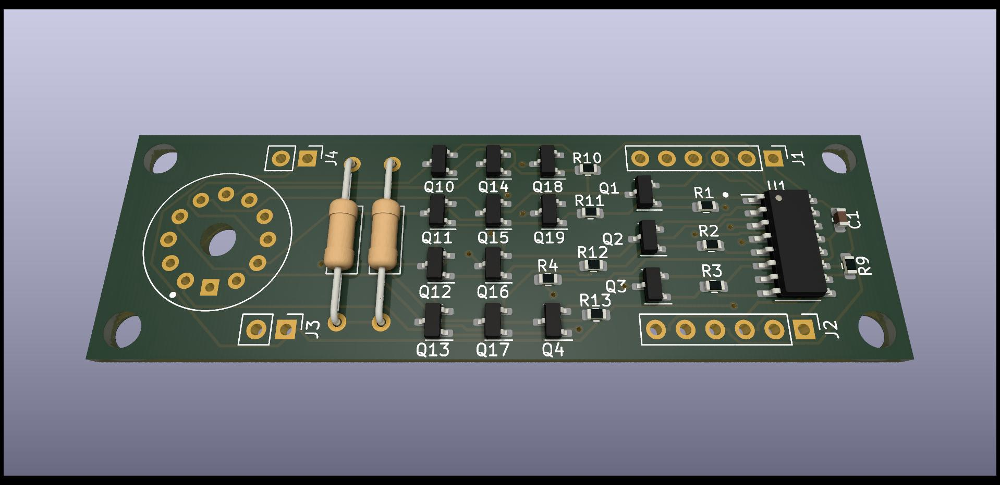

# Modular nixie board

These are the Kicad design files for the [Modular nixie project at Hackaday](https://hackaday.io/project/188427-modularnixie).

## Versioning

First release November 2022

## Notes

The minimum lines required to use this board are: GND, SER (data), SRCLK (shift), RCLK (strobe) and power for the shift register 74HC595 and the nixie. The shift register lines are designed to cascade for multiple digits. The hardware configuration calls for the least significant digit to be shifted in first.

## Authors

* **Ken Yap**

## License

See the [LICENSE](LICENSE.md) file for license rights and limitations (MIT).
